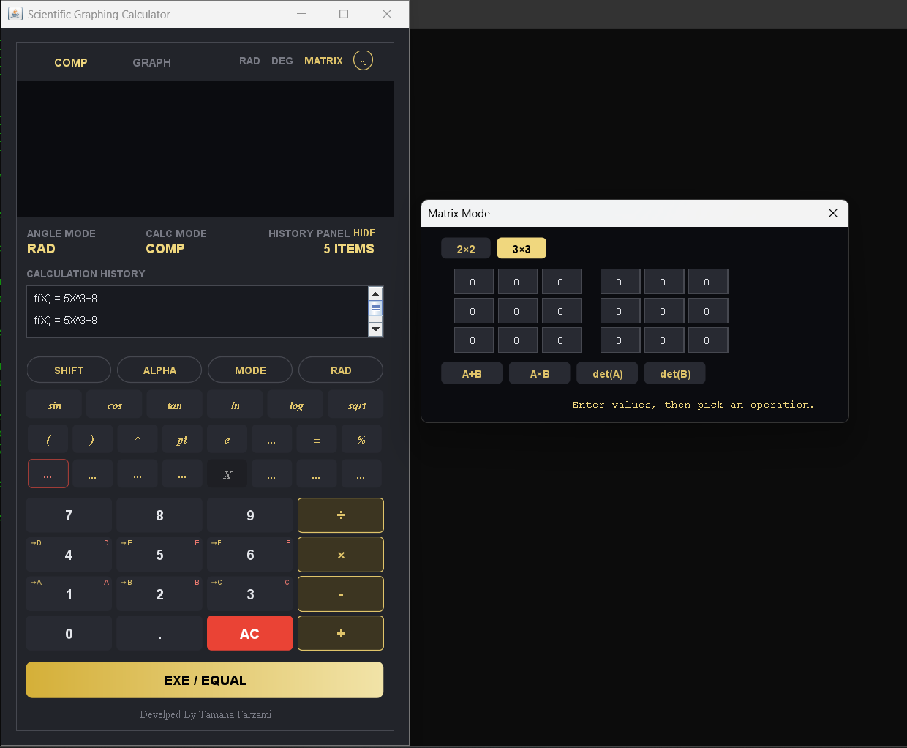
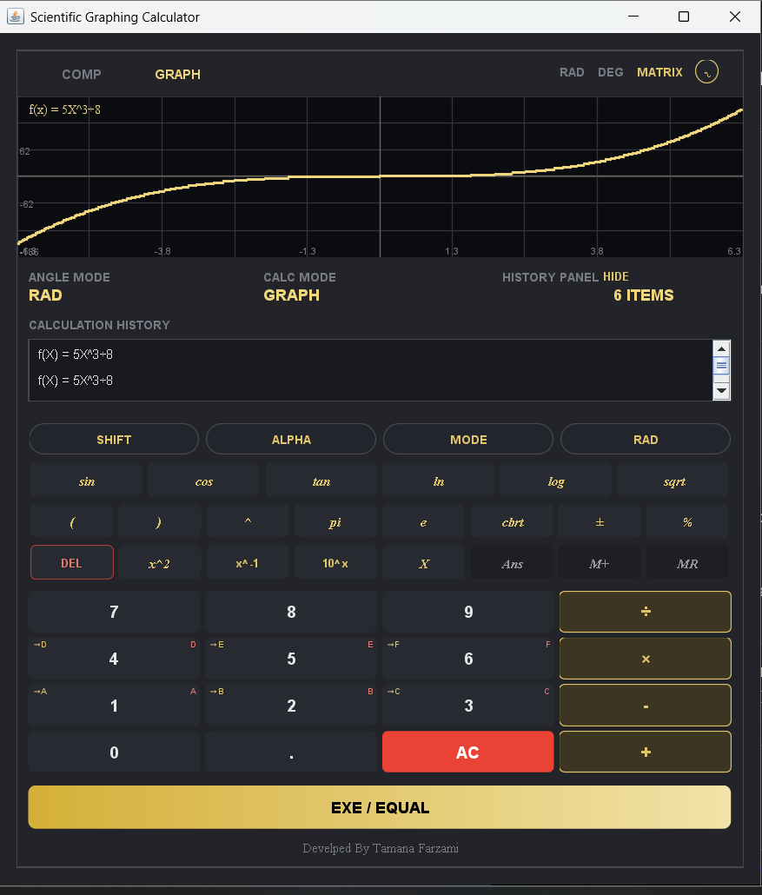

# Offline Scientific Calculator

A fully offline scientific calculator built with Java, designed to provide students with a powerful, accessible mathematical tool without requiring an internet connection.

> **Built with a simple idea:** access to useful educational tools should not depend on having internet access every day.

## Download

The latest Windows installer is available on the [Releases](https://github.com/Tamana543/Scientific-Calculator-Application-/releases/tag/V.1.2.0) page.

Download the `.exe`, run it, and follow the installer — no Java installation required, the runtime is bundled in.

> **Note:** this app isn't digitally signed (a code-signing certificate costs money, which isn't realistic for a student project), so Windows SmartScreen may show a *"Windows protected your PC"* warning on first run. This is normal for small independent projects — click **More info → Run anyway** to continue.

## About the Project

This project is a desktop scientific calculator developed in Java with the goal of creating a practical mathematical tool that can be used **completely offline**.

It was especially inspired by girls and students living in Afghanistan who may not have reliable or continuous access to the internet. Instead of depending on online calculators, websites, or cloud-based tools, this application can be installed once and then used whenever it is needed — even without an internet connection.

The project started as a simple calculator and gradually evolved into a more complete scientific-calculator application with memory functions, keyboard input, calculation history, graphing, matrices, persistent state, and other features found in modern calculators.

---

## Features

### Calculator

- Basic arithmetic operations
- Scientific calculations
- Parentheses and operator handling
- `+/-` sign toggle
- Percentage calculations
- `AC` (All Clear)
- `DEL` (Delete)
- `EXE` (Execute)
- Keyboard input support

### Alpha & Shift Functions

The calculator includes dedicated **ALPHA** and **SHIFT** functionality.

- Store values using memory variables
- Recall stored values
- Use variables directly in calculations
- Visual indicators for functions assigned to buttons
- Memory values can persist between application sessions

### Calculation History

The application keeps track of previous calculations.

- View previous calculations
- Click a previous calculation to recall it
- Edit recalled expressions
- Re-run previous calculations

### Keyboard Support

The calculator can be operated without relying entirely on mouse input.

| Keyboard | Calculator |
|---|---|
| `0–9` | Numbers |
| `+ - * /` | Operators |
| `Enter` | `EXE` |
| `Backspace` | `DEL` |
| `Esc` | `AC` |

### Graphing

The GRAPH mode allows mathematical functions to be visualized directly inside the application.

#### Multiple Functions

Multiple functions can be plotted on the same graph, allowing users to compare functions visually.

For example:

```text
f₁(x) = x²
f₂(x) = 2x + 1
```

#### Zoom & Pan

The graph can be explored interactively:

- Scroll to zoom
- Drag to move around the graph
- Explore different regions of a function

#### Trace Mode

Clicking on a point of a plotted function displays its coordinates.

```text
x = ...
y = ...
```

### Matrix Mode

The MATRIX mode provides basic matrix functionality.

Currently supported operations include:

- 2×2 matrices
- 3×3 matrices
- Matrix entry
- Matrix addition
- Matrix multiplication
- Determinant calculation

### Persistent State

The calculator can preserve important information between sessions.

Stored information can include:

- Memory variables
- Stored values
- Calculation history
- Application state

This means users do not have to start from zero every time they reopen the application.

### Responsive Interface

The interface is designed to work with different window sizes rather than relying on one fixed resolution.

The layout adapts when the application window is resized or maximized.

### Clipboard Support

Calculation results can be copied directly from the display to the system clipboard.

This makes it easier to move results into:

- Documents
- Assignments
- Notes
- Other applications

---

## Why Offline?

For many students, internet access is something that cannot always be assumed.

An online calculator can be useful, but it becomes unavailable when there is:

- No internet connection
- Unstable connectivity
- Limited mobile data
- Restricted access to online services
- A need to study somewhere without connectivity

This application is designed around a different assumption:

> **The calculator should work whether the internet is available or not.**

Once installed, the application does not need an internet connection to perform its core functions.

This makes it particularly useful for students who need a reliable mathematical tool while studying in environments where internet access is limited or inconsistent.

---

## Technology Stack

The project is built primarily with Java.

### Core Technologies

- **Java**
- **Java Swing** — graphical user interface
- **Java AWT** — keyboard, clipboard, and desktop interaction
- **Java File I/O** — persistent application state
- **Java Graphics** — function plotting and graph interaction

### Application Architecture

The application is organized around separate responsibilities for different parts of the calculator, including:

- Calculator logic
- Expression evaluation
- UI components
- Memory/state management
- Graphing
- Matrix operations
- Keyboard handling
- History management
- Persistent state

The goal is to keep the application maintainable as additional mathematical features are added.

---

## Getting Started

### Requirements

To run the project from source, you need:

- Java Development Kit (JDK)
- Java-compatible development environment
- A desktop operating system capable of running Java applications

A packaged executable is also provided for users who do not want to run the project directly from source.

### Running from Source

Clone the repository:

```bash
git clone https://github.com/Tamana543/Scientific-Calculator-Application-
```

Move into the project directory:

```bash
cd Scientific-Calculator-Application-
```

Compile and run the application according to the project structure.

```bash
java Calculator
```


If using an IDE such as IntelliJ IDEA, Eclipse, or VS Code, open the project folder and run `Calculator.java` as the main class.

---

### Building the Windows Installer Yourself

A `build.bat` script in the project root automates the full rebuild (compile → jar → installer):

```bash
build.bat
```

This produces a `Scientific Calculator-X.X.exe` in the project root, using `manifest.txt` for the jar manifest and `calculator.ico` for the app icon.

Requirements for this step specifically:
- A JDK that includes `jpackage` (JDK 17+)
- The [WiX Toolset](https://wixtoolset.org/) installed and on your system `PATH` (required by `jpackage` to build a Windows `.exe` installer)

---

## Project Structure

The project currently keeps all source files flat in the project root, using Java's default (unnamed) package rather than nested subfolders:

```text
Scientific-Calculator-Application/
│
├── Calculator.java        # Main application window, UI layout, and event wiring
├── Evaluator.java         # Expression parsing and evaluation
├── GraphCanvas.java       # Graphing: plotting, zoom/pan, trace mode
├── MatrixPanel.java       # Matrix mode (entry, add, multiply, determinant)
├── RoundedButton.java     # Custom styled button component used throughout the UI
├── StatePersistence.java  # Saves/restores memory, variables, and history between runs
├── Theme.java             # Shared colors and styling constants
├── CalcUtils.java         # Small shared formatting helpers
│
├── manifest.txt           # Jar manifest (declares the main class)
├── calculator.ico         # Application icon used by the packaged installer
├── build.bat              # One-command rebuild: compile -> jar -> installer
├── LICENSE
└── README.md
```

> As the project grows, this may be reorganized into subfolders/packages - this reflects the current structure.

---

## Screenshots
<p float="left">
  &nbsp;&nbsp;&nbsp;&nbsp;
  
</p>


## Design Goals

The project is built around several principles:

### 1. Offline-first

Core functionality should not depend on an internet connection.

### 2. Practicality

Features should solve real problems rather than exist only as demonstrations.


### 3. Accessibility

The application should be understandable and usable by students with different levels of technical experience.

### 4. Familiar interaction

Keyboard shortcuts, memory functions, history, graphing, and calculator-style controls are designed to make the application feel familiar to anyone who has used a scientific calculator.

### 5. Expandability

The project is structured so that additional mathematical functionality can be added over time.

---

## Current Status

The calculator currently includes:

- [x] Basic calculator functionality
- [x] ALPHA memory functions
- [x] SHIFT functions
- [x] Memory store and recall
- [x] Keyboard input
- [x] Calculation history
- [x] History recall
- [x] Sign toggle
- [x] Percentage
- [x] Clipboard copy
- [x] Multiple functions on one graph
- [x] Graph zoom and pan
- [x] Graph trace/cursor
- [x] Matrix mode
- [x] Responsive/resizable layout
- [x] Persistent application state
- [x] Application icon

### Final Packaging

- [x] Final Windows `.exe`
- [x] Final cleanup
- [x] Release preparation (publish on GitHub Releases)

---

## Future Improvements

Possible future versions may include:

- More advanced matrix operations
- More scientific functions
- Equation solving
- Numerical integration
- Numerical differentiation
- More graphing controls
- Improved expression parsing
- Additional keyboard shortcuts
- Exporting calculation history
- Additional platform support
- Improved accessibility options

The project is intentionally designed so these features can be added gradually.

---

## Educational Purpose

This project is not intended to replace a full commercial graphing calculator.

Instead, it is a practical educational project created to explore how mathematical software works while building something that can be genuinely useful to students.

It combines concepts from:

- Object-oriented programming
- GUI development
- Event handling
- Mathematical computation
- Data persistence
- File handling
- Graphical rendering
- User interaction
- Software packaging

---

## Motivation

There are students who have access to computers but cannot depend on having internet access whenever they need it.

For those students, an offline application can make a small but meaningful difference.

This project started as a Java programming project, but its purpose became bigger than simply completing an assignment or building a calculator.

It is an attempt to create a tool that a student can install once and keep using:

**at home, at school, in a library, or anywhere else — with or without internet access.**

---

## License

This project is currently available for educational and personal use.

_MIT_

---

## Author

**Tamana Farzami**

Computer Science / Software Development Student

GitHub: [@Tamana543](https://github.com/Tamana543)

---

## A Note from the Developer

The idea behind it is simple: **students should be able to have useful educational tools even when internet access is not always available.**

I hope this project can eventually be useful to girls and students who need an offline mathematical tool for their studies.

There is still a lot that can be improved, and that is part of the point of the project. It is a work in progress, and I plan to continue learning from it and improving it over time.

